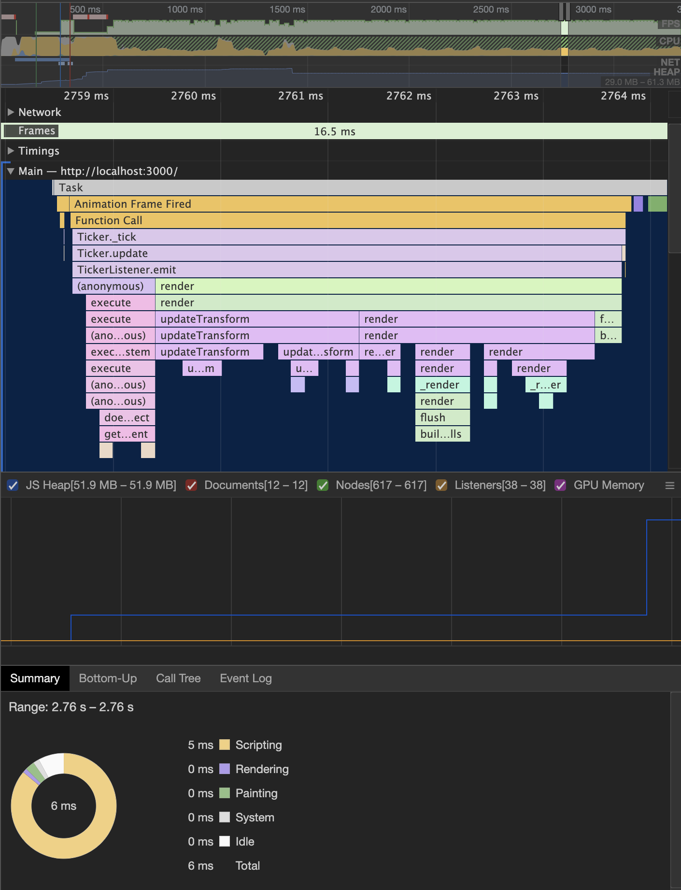

# Sprite and Tile Performance

First thing is first, I need to get a sample of base performance. In this test I do nothing but close the opening dialog.


This version creates over 15,749 sprites! There are only two texture sheets, but even with that advantage, that is a lot of sprites for PIXI to render and transform. In fact, if we dig into the call stack in the performance log, we see that applyTransform is called a lot. And yet, with all this it's only taking 6ms each frame!



So why even bother? PIXI.JS has a great performance without us having to do anything.

Despite the amazing performance, I still get visual bug like this:


## Particle Container
[PIXI.ParticleContainer](http://pixijs.download/release/docs/PIXI.ParticleContainer.html) is a Container designed for a large number of sprites. Anything over 1,000 is considered large. So switching to this should provide a performance increase.

It'll take more than a single line change to try out the ParticleContainer. Things like BitmapText can't be a child of ParticleContainers.

```
// Create a container for each layer.
// Tile layers should use the ParticleContainer for better performance.
let container = new PIXI.ParticleContainer();
if (layer.type !== 'tilelayer') {
  container = new PIXI.Container();
}
```


And zoomed in we can seed the total time went from 6ms to 1ms! That looks like an awesome improvement with just a few lines of code.


 I wish I could call it a day and say we added 5x performance increase, but closer testing reveals several new bugs. Like large parts of the map are blank! So as quick fix, ParticleContainer is not going to work in this case.


## Render texture
[PIXI.RenderTexture](./http://pixijs.download/release/docs/PIXI.RenderTexture.html) looks like promising route. Instead of keeping all 15k sprites, we can render them into a new single texture. This would turn 5225 * 3 sprites into 3 sprites. It would mean that instead of transforming 15,675 sprites, it would only need to transform 3 sprites.

I will turn each `tilelayer` into a single image.

Why not pre-render the tile images and then load those? We could! It doesn't really matter where the conversion between 15,675 tiles to 3 images take place. I want the quick test cycle without tooling (because I don't have any tooling). So doing the conversion when the Tiled map is loaded makes sense for this project. If I had an artist that could quickly create the final images, then I would use that route. But considering it's just me, dynamic generation is the best option.

```
if (layer.type === 'tilelayer') {
  layer.data.forEach((tileID, index) => {
    const sprite = createTiledSprite(textures, tileID);
    const x = (0 | index % layer.width) * tileWidth;
    const y = (0 | index / layer.width) * tileHeight;
    sprite.position.set(x, y);
    container.addChild(sprite);

    // If we are on the collision layer, and the tile isn't blank, add it to collision
    if (layer.name === mapLayers.collision && sprite.data.tileID !== 0) {
      createColliderEntity(sprite);
    }
  });
}
```

I have a few options on how to refactor and upgrade the code to use the Render Texture. First I need a function to create the new texture. I'll call it `mergeSprites`. It should return a single sprite using the RenderTexture. But what arguments should it take? An array of Sprites? A Container? Two sprites, one for output and one for input?

Looking at the existing code, gives us a few ideas on what arguments I have available. Taking a single Container looks the easiest. I could leave most of the code alone, and just add a few new lines at the end.

```
// When the layer is just tile images, merge them into a single sprite.
if (layer.type === 'tilelayer') {
  // Merge the tiles into a single Sprite
  map.addChild(mergeSprites(container));
}
else {
  map.addChild(container);
}
```


And with the change:

