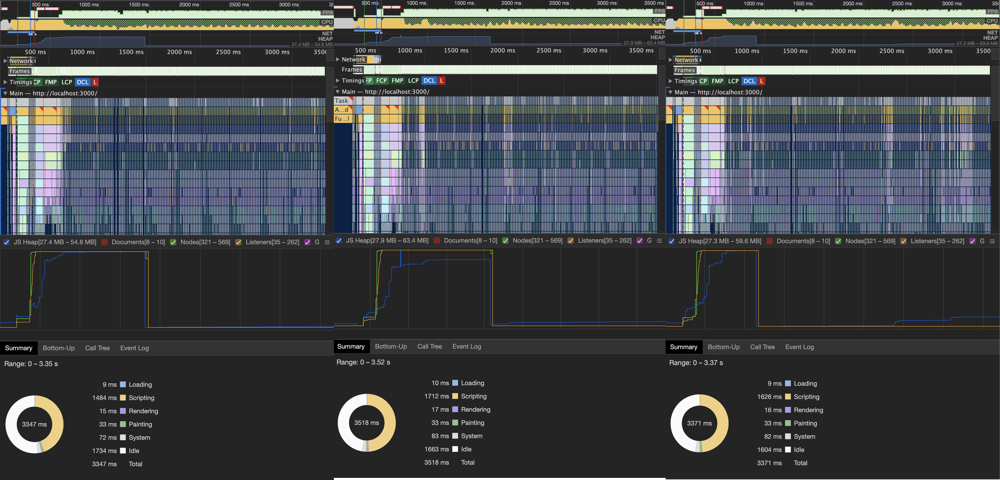

# Sprite and Tile Performance

First thing is first, I need to get a sample of base performance. In this test I do nothing but close the opening dialog.



This version creates over 15,749 sprites! There are only two texture sheets, but even with that advantage, that is a lot of sprites for PIXI to render and transform. In fact, if we dig into the call stack in the performance log, we see that applyTransform is called a lot. And yet, with all this it's only taking 6ms each frame!


So why even bother? PIXI.JS has a great performance without us having to do anything.

Despite the amazing performance, I still get visual bug like this:


## Particle Container
[PIXI.ParticleContainer](http://pixijs.download/release/docs/PIXI.ParticleContainer.html) is a Container designed for a large number of sprites. Anything over 1,000 is considered large. So switching to this should provide a performance increase.

It'll take more than a single line change to try out the ParticleContainer. Things like BitmapText can't be a child of ParticleContainers.

```
// Create a container for each layer.
// Tile layers should use the ParticleContainer for better performance.
let container = new PIXI.ParticleContainer();
if (layer.type !== 'tilelayer') {
  container = new PIXI.Container();
}
```


And zoomed in we can seed the total time went from 6ms to 1ms! That looks like an awesome improvement with just a few lines of code.


I wish I could call it a day and say we added 5x performance increase, but closer testing reveals several new bugs. Like large parts of the map are blank!


## Render texture
[PIXI.RenderTexture](./http://pixijs.download/release/docs/PIXI.RenderTexture.html) looks like promising route. Instead of keeping all 15k sprites, we can render them into a new single texture.
