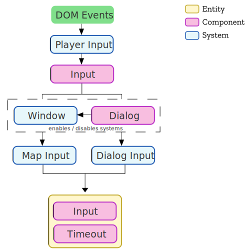
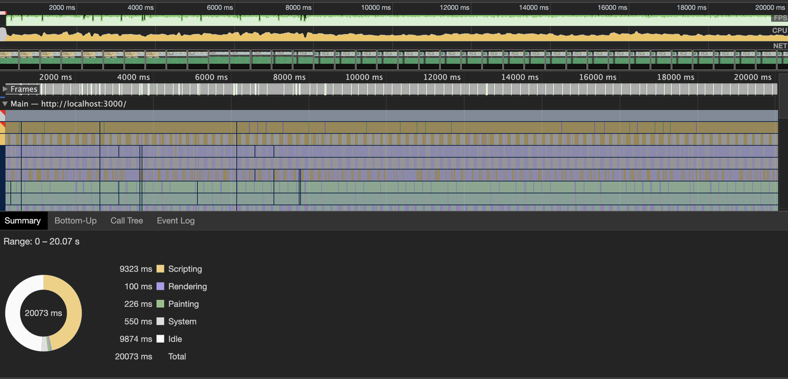
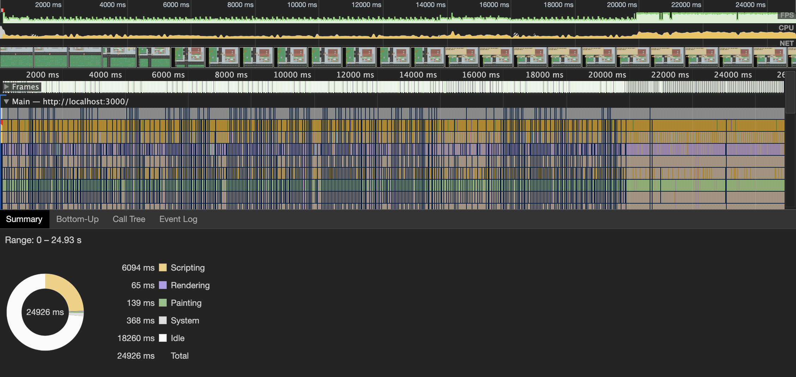

# Input System

The goal of the Input system is to translate raw input into a standard format that other systems and utilities can use.

So here is what I build:



The `PlayerInputSystem` waits for DOM Events (like keyup) and updates the `Input` component. It translates the raw event data into a standard that can be used by other systems.

For example, `KeyW` and `ArrowUp` are translated into `MoveUp`.

Then either the `MapInputSystem` or the `DialogInputSystem` read from `Input` and update the game state.

The `WindowSystem` enables and disables the `MapInputSystem` and the `DialogInputSystem` based on the `Dialog` component state.

The `MapInputSystem` translates the player input into velocity on the player sprite.

The `DialogInputSystem` moves the cursor sprite between slots.

When one of the subsystems, `MapInputSystem` or `DialogInputSystem` handle the user's input, they add the `Timeout` component to the entity with the `Input` component.


## What are the issues with this design?

Using the `Timeout` component to debounce the input was an interesting experiment, but I think it is too in efficient. I could get the same result with a timestamp. I'm not sure on the exact cost, but a timestamp should be an O(1) operation while adding and removing `Timeout` is probably much higher.


That means instead of
```
// Timeout to give the user time to react
if (tookAction) {
  inputEntity.addComponent(Timeout, { value: 30 });
}
```

Instead I could do
```
  inputState.waitUntil = time + 300;
```


Running a performance test using `Timeout`



Running a performance test using `waitUntil`



Wow, that almost cut the Scripting time in half!

Will this improvement continue if we completely remove `Timeout` and the `TimeoutSystem`?
