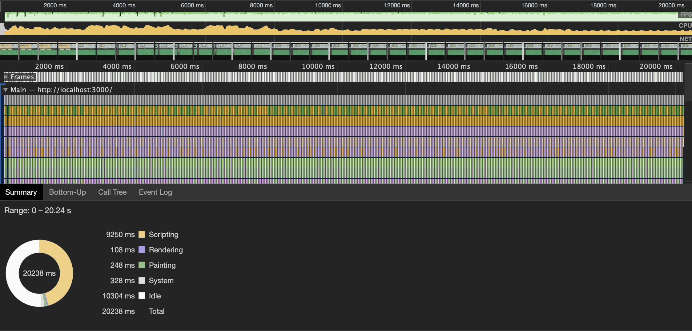

# ECSY Input System in my LDJam 46 Game

The goal of the Input system is to translate raw input into a standard format that other systems and utilities can use.

So here is what I build:


The `PlayerInputSystem` waits for DOM Events (like keyup) and updates the `Input` component. It translates the raw event data into a standard that can be used by other systems.

For example, `KeyW` and `ArrowUp` are translated into `MoveUp`.

Then either the `MapInputSystem` or the `DialogInputSystem` read from `Input` and update the game state.

The `WindowSystem` enables and disables the `MapInputSystem` and the `DialogInputSystem` based on the `Dialog` component state.

The `MapInputSystem` translates the player input into velocity on the player sprite.

The `DialogInputSystem` moves the cursor sprite between slots.

When one of the subsystems, `MapInputSystem` or `DialogInputSystem` handle the user's input, they add the `Timeout` component to the entity with the `Input` component.


## What are the issues with this design?

Using the `Timeout` component to debounce the input was an interesting experiment, but I think it is too inefficient. I could get the same result with a timestamp. I'm not sure about the exact cost, but a timestamp should be an O(1) operation while adding and removing `Timeout` is probably much higher.


That means instead of
```
// Timeout to give the user time to react
if (tookAction) {
  inputEntity.addComponent(Timeout, { value: 30 });
}
```

Instead I could do
```
  inputState.waitUntil = time + 300;
```


Running a performance test using `Timeout`


Running a performance test using `waitUntil`


Wow, that almost cut the Scripting time in half!

Will this improvement continue if we completely remove `Timeout` and the `TimeoutSystem`?

Grep shows me that the only system left using `Timeout` is the `AISystem`. It's also using the `Timeout` as a way to debounce simulated inputs. The same timestamp method will work here just as well as it did in the Input system. The big difference is that the `AISystem` does not update the player's `Input` component. Instead, it reads and updates an `AI` component.

To make the same `waitUntil` change I made with the player Input, I need a place to store the `waitUntil` value. The existing `AI` component only holds a single value. So to make this change, I'll need to upgrade it first.

```
export class AI extends Component {
  constructor() {
    super();
    this.reset();
  }

  reset() {
    this.value = '';
    this.waitUntil = 0;
  }

  set(obj) {
    this.value = obj.value;
    this.waitUntil = obj.waitUntil;
  }
}
```





Well Dang, that was not the effect I expected. So either I'm measuring wrong, or removing `Timeout` didn't have as big of an effect as I thought.
Digging deeper into the performance log, I can see most of the time is spent transforming all the tiles on the map. There are even visual bugs where sometimes the tiles get black lines between them. So that'll be my next area to fix!
