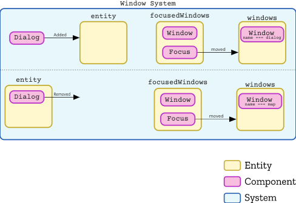

# Window, Dialog, and Focus



When a `Dialog` component is added to an entity, it triggers the windows to change focus to the dialog window. It also starts/stops a list of systems on the `Window` component. It also toggles the visibility of the windows, so the dialog window is only visible when focused.

While building this, I kept struggling with figuring out the right level of components vs component data.

Example: To find the dialog window entity, it loops over all `Window` components looking for the one with the name __dialog__. Instead of looping over the list every frame myself, I could add a new component like `WindowDialog`, then I could use the ECSY queries to keep a reference to the dialog window.

In fact, that is probably a lot more efficient than what I am going. I repeat the same two O(2) loops every frame. Is there any downside to using a component for this? No? Alright, let's make this change!


```
findWindowByName(name) {
  return this.queries.windows.results.find((entity) => entity.getComponent(Window).name === name);
}
```

I want to remove this method, and replace it with `this.queries.windowsDialog.results[0]` and `this.queries.windowsMap.results[0]`. To do that I need to update `startGame`, which sets up the game and window systems.

```
windowsDialog: {
  components: [WindowDialog],
},
windowsMap: {
  components: [WindowMap],
},
windowsFocused: {
  components: [Window, Focus],
},
```

So how do I know when the focus has changed? I could use the the `changed` query. Is there a reason not too? Only if I wanted to avoid reactive queries. But I don't think I do. There is an amazing reason not to use changed. We aren't changing the data!

A simple property to keep track of the active window will do the trick.

Old version
```
// Switch Focus when the Popup is added/removed.
const dialogWindow = this.findWindowByName('dialog');
const dialogContainer = dialogWindow.getComponent(Sprite).value;

if (dialog.added.length > 0) {
  console.log('dialog added', dialog.added[0]);
  this.setFocusOnWindow(dialogWindow);
  dialogContainer.visible = true;
}
else if (dialog.removed.length > 0) {
  console.log('dialog removed', dialog.removed[0]);
  this.setFocusOnWindow(this.findWindowByName('map'));
  dialogContainer.visible = false;
}

```
scenario

New Version
```
// when the focused window changes
if (this.activeFocus !== windowsFocused.results[0]) {
  this.activeFocus = windowsFocused.results[0];
  // turn off all the old systems
  windowsNotFocused.results.forEach(e => this.toggleSystems(e, 'stop'));
  // turn on the new systems
  windowsFocused.results.forEach(e => this.toggleSystems(e, 'play'));
}
```
In this version the system keeps a property called `activeFocus` that holds a reference to the currently focused window. This is how we know if the focused window changes without using the reactive queries. (We are moving away from reactive queries due to bugs). Someone could argue that instead of holding the `activeFocus` value on the system, I should put it in a component that the system uses. Which I could do, but I don't see the point. It would add another layer of abstraction that I don't need.


This has been all well and good for the Window system, but I removed the part that was switching the focus. I need to add that back. Since it was the dialog system that uses `Dialog`, it seems it make sense to have it there. Or maybe a system just for that?

Oh and there is a problem with this. I don't unset focus from the existing windows. I need to do that too.


huh... with the `Focus` component, I don't even really need to start/stop systems. The system could check if it's window has the focus component or not.

---

So do I continue down this existing path of having the Window system watch for the `Dialog` component, and then switch the focus, toggling systems and visibility? Or do I do something different?

The Dialog thing feels weird to me in the first place, so if I could redo it, what would I do? (because I can redo it!)

Then to use it,
```
execute() {
  const { windows, windowsDialog, windowsMap } = this.queries;
  // stuff ...
}
```


## Bugs

1. Dialogs that won't close!
2. Random Dialog opening!
3. Random Text in dialog not working.

## Solution for Bug 1 & 2
In WindowSystem I was checking `dialog.results.length` in an if-else. The body would then switch the Focused window. The problem is that my if-else body behaved as if it was only called when a `Dialog` component is added/removed from an entity. But the if code was checking if there was a dialog this frame. The result was a build-up of window switching that resulted in bugs.

#### Old Version
```
if (dialog.results.length > 0) {
  // ...
} else {
  // ...
}
```

#### New Version
```
if (dialog.added.length > 0) {
  // ...
}
else if (dialog.removed.length > 0) {
  // ...
}
```

This seems like a great solution, until it stops working. :( After letting the game sit for a while, the dialog starts acting up again. When I looked into the issue, I can see that  `this.dialog.added.length === 1`, `this.dialog.removed.length === 1`, and `this.dialog.results.length === 1` and the one item is the same item between all of them.

I was worried about the reactive queries (added/removed) when I started. So I would like a solution that doesn't use them at all.
